---
title:       Interactive HTML Slides for Geometry Processing
subtitle:    using the PMP library
author:      Mario Botsch
affiliation: Graphics & Geometry Group Bielefeld University
...

--------------------------------------------------------------------------------

# How to use these HTML slides

- Use the cursor keys **left**/**right** to navigate through the slides
- Click **page number** (bottom right) to open navigation menu
- Press **f**/**ESC** to enter/leave fullscreen mode
- Press **o** or **ESC** to enter/leave overview mode
- **Double-click** an item (e.g. an image) to zoom in/out.

--------------------------------------------------------------------------------

# Interactive Demo Applications

- The demos are written in C++ using the [PMP library](http://pmp-library.org)
- They are cross-compiled to Javascript using [emscripten](http://emscripten.org)
- They require support for WebGL 2
    - See <https://caniuse.com/webgl2>
    - The demos work nicely on Chrome, Chromium, or Firefox
    - They do not run on Apple Safari in MacOS and iOS

--------------------------------------------------------------------------------

# Subdivision Surfaces {.section}

--------------------------------------------------------------------------------

# Loop Subdivision

- Subdivision scheme for triangle meshes\
  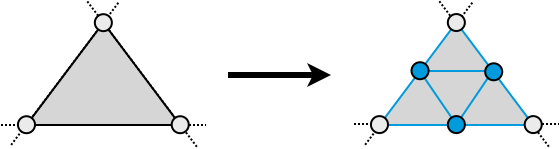
- Generates $C^2$ continuous limit surfaces:
    - $C^1$ for extraordinary vertices (valence ≠ 6)
    - $C^2$ continuous everywhere else

[Loop, *Smooth Subdivision Surfaces Based on Triangles*, M.S. thesis, 1987](https://www.microsoft.com/en-us/research/wp-content/uploads/2016/02/thesis-10.pdf){target="_blank" .footer}

--------------------------------------------------------------------------------

# Loop Subdivision Rules

HSPACE(100px)
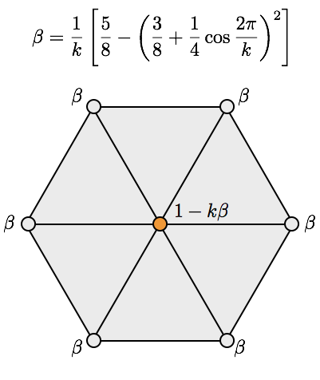

[Loop, *Smooth Subdivision Surfaces Based on Triangles*, M.S. thesis, 1987](https://www.microsoft.com/en-us/research/wp-content/uploads/2016/02/thesis-10.pdf){target="_blank" .footer}

--------------------------------------------------------------------------------

# Generalized Catmull-Clark Subdivision

- Subdivision scheme for **arbitrary polygons**\
  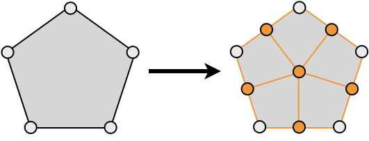
- Connect new face points to edge-vertex-edge triple
    - Turns all polygon faces into quads
- Generates $C^2$ continuous limit surfaces:
    - $C^1$ for extraordinary vertices (valence ≠ 4)
    - $C^2$ continuous everywhere else

[DeRose et al, *Subdivision Surfaces in Character Animation*, SIGGRAPH 1998](http://graphics.pixar.com/library/Geri/paper.pdf){target="_blank" .footer}

--------------------------------------------------------------------------------

# Catmull-Clark Rules

VSPACE(50px)

::: col30
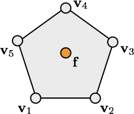

::: tiny
$$\vec{f} = \frac{1}{n} \sum_{i=1}^n \vec{v}_i$$
:::
:::

::: col30
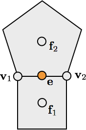

::: tiny
$$\vec{e} = \frac{1}{4} \left(\vec{v}_1 + \vec{v}_2 + \vec{f}_1 + \vec{f}_2\right)$$
:::
:::

::: col40
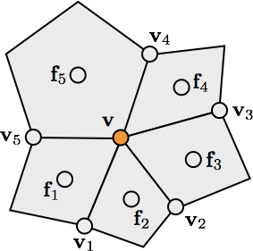

::: tiny
$$
\vec{v} = \frac{k-2}{k} \vec{v}
+ \frac{1}{k^2} \sum_{i=1}^k \vec{v}_i
+ \frac{1}{k^2} \sum_{i=1}^k \vec{f}_i
$$
:::
:::

[DeRose et al, *Subdivision Surfaces in Character Animation*, SIGGRAPH 1998](http://graphics.pixar.com/library/Geri/paper.pdf){target="_blank" .footer}

--------------------------------------------------------------------------------

# Try it yourself!

{ #demo width=1000px height=550px }

--------------------------------------------------------------------------------

# Try it yourself!

{ width=1000px height=550px }

[Model created using Blender, original from Willem-Paul van Overbruggen]{.footer}

--------------------------------------------------------------------------------

# Surface Smoothing {.section}

--------------------------------------------------------------------------------

# Diffusion Flow on Meshes

- Continuous PDE: $\frac{\partial \vec{x}}{\partial t} \;=\; \lambda \Delta \vec{x}$
- Explicit integration per vertex: $\vec{x}_i \leftarrow \vec{x}_i + \delta t \, \lambda \Delta \vec{x}_i$

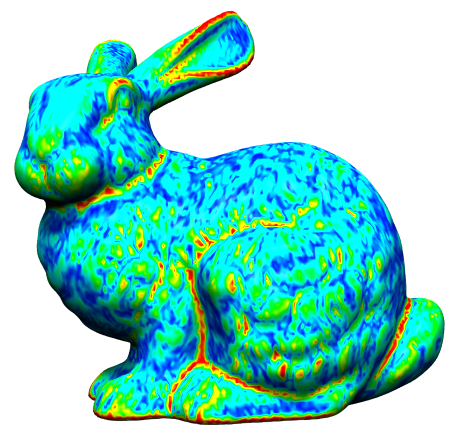{ height=300px }
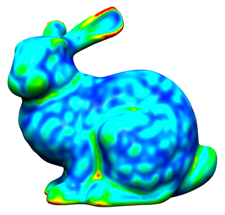{ height=300px }
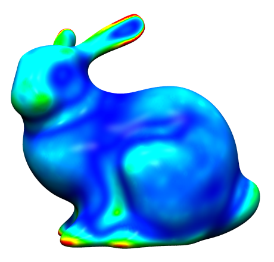{ height=300px }

--------------------------------------------------------------------------------

# Uniform Laplace Discretization

$$
\laplace \vec{x}\of{v_i}
\;:=\;
\frac{1}{\abs{\set{N}_1\of{v_i}}}
\sum_{v_j \in \set{N}_1\of{v_i}} \left( \vec{x}\of{v_j} - \vec{x}\of{v_i} \right)
$$

## 7 3

- Properties
	- simple and efficient
	- depends only on connectivity
	- does not take into account geometry at all

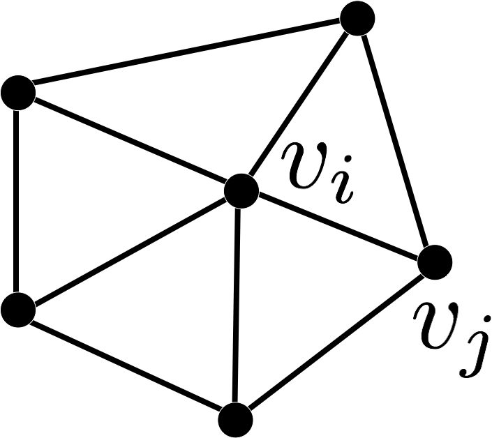{ height=200px }

[Taubin, *A Signal Processing Approach to Fair Surface Design*, SIGGRAPH 1995](http://mesh.brown.edu/taubin/pdfs/taubin-sg95.pdf){.footer target="_blank"}

--------------------------------------------------------------------------------

# Cotan Laplace Discretization

$$
\laplace \vec{x}\of{v_i} \;:=\;
\frac{1}{2A\of{v_i}}
\sum_{v_j \in \set{N}_1\of{v_i}}
\left( \cot \alpha_{ij} + \cot \beta_{ij} \right)
\left( \vec{x}\of{v_j} - \vec{x}\of{v_i} \right)
$$

## 7 3

- Properties
	- takes geometry and connectivity into account
	- more accurate discretization
	- can be derived through FEM

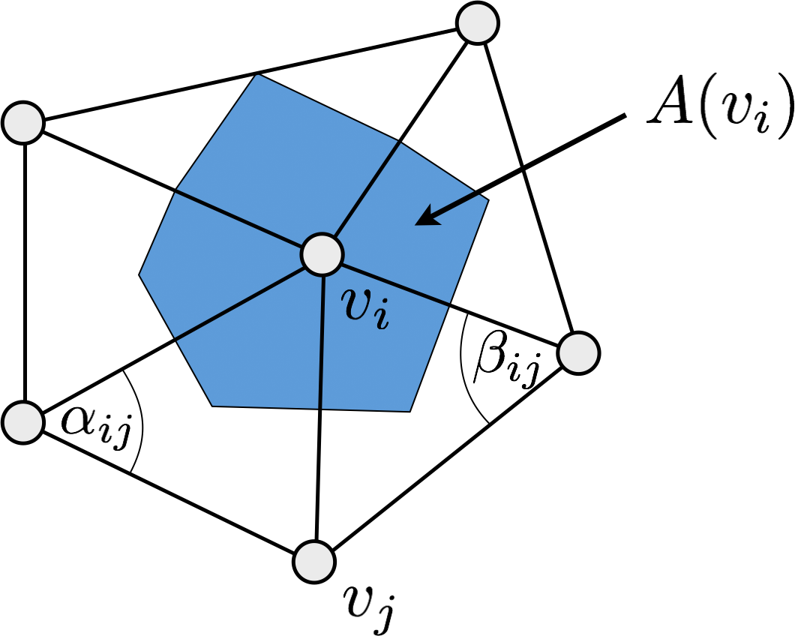{ height=200px }

[Meyer et al, *Discrete Differential-Geometry Operators for Triangulated 2-Manifolds*, VisMath III, 2003](http://multires.caltech.edu/pubs/diffGeoOps.pdf){target="_blank" .footer}

--------------------------------------------------------------------------------

# Uniform or Cotan Discretization?

## 5 5

- Uniform Laplacian is an inaccurate discretization
- Might be non-zero even for planar meshes
- Smoothes geometry **and** triangulation
- Might be desired for mesh regularization

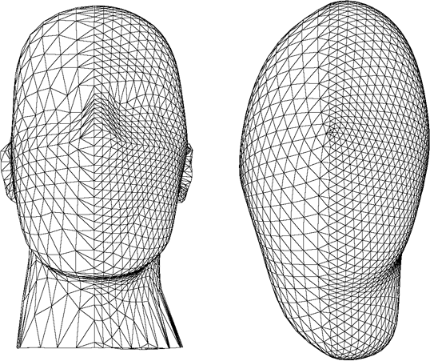{ width=400px }

[Desbrun et al, *Implicit Fairing of Irregular Meshes using Diffusion and Curvature Flow*, SIGGRAPH 1999](http://w.multires.caltech.edu/pubs/ImplicitFairing.pdf){target="_blank" .footer}

--------------------------------------------------------------------------------

# Numerical Integration

>- Let's write the position update in matrix notation
>- Write all points $\vec{x}_i^{(t)}$ in a large vector/matrix:
>  $$\vec{X}^{(t)} = \trans{\left( \vec{x}_1^{(t)}, \ldots, \vec{x}_n^{(t)}  \right)} \in \R^{n\times 3}$$
>- Matrix version of explicit integration
>  $$\vec{X}^{(t+1)} = (\vec{I} + \delta t \, \lambda \vec{L}) \, \vec{X}^{(t)}$$
>- Matrix version of implicit integration
>  $$(\vec{I} - \delta t \, \lambda \vec{L}) \, \vec{X}^{(t+1)} = \vec{X}^{(t)}$$

HINT({{Easy to implement, but requires small $\delta t  \lambda$ for stability}}, 750, 400)
HINT({{Works for any $\delta t  \lambda$, but has to solve linear system(s)}}, 750, 530)

[Desbrun et al, *Implicit Fairing of Irregular Meshes using Diffusion and Curvature Flow*, SIGGRAPH 1999](http://w.multires.caltech.edu/pubs/ImplicitFairing.pdf){target="_blank" .footer}

--------------------------------------------------------------------------------

# Try it yourself!

{ #demo width=1000px height=600px }

--------------------------------------------------------------------------------

# Isotropic Remeshing {.section}

--------------------------------------------------------------------------------

# Isotropic Triangle Remeshing

### 1 1 1

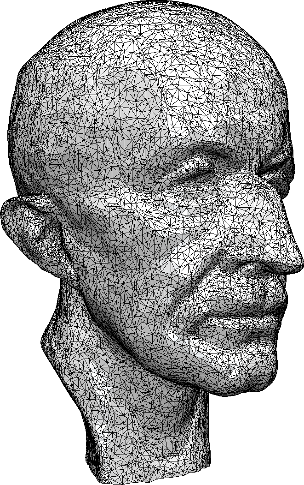{ height=500px }

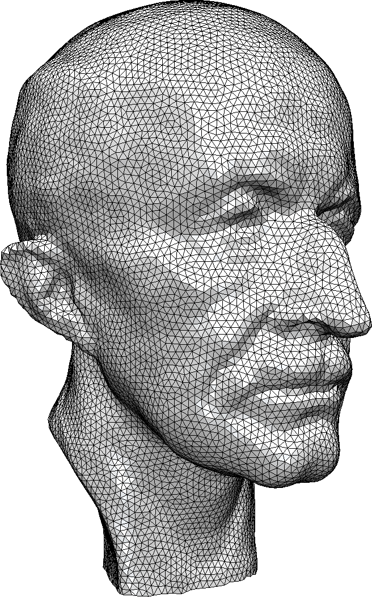{ height=500px }

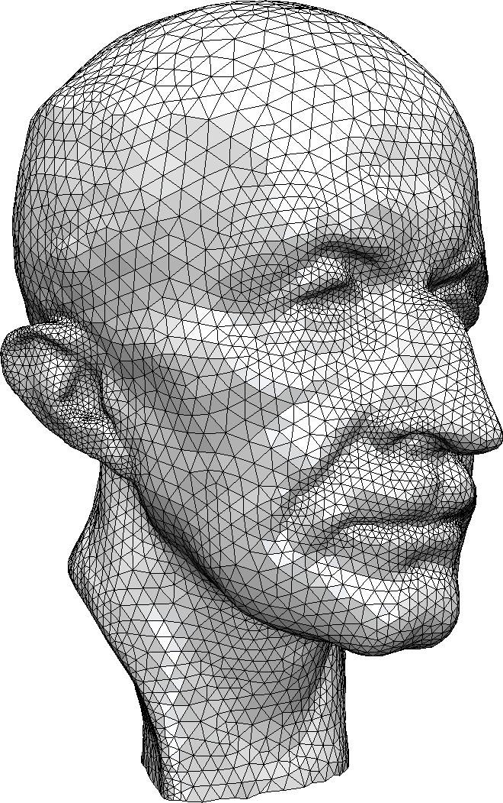{ height=500px }

--------------------------------------------------------------------------------

# Uniform Remeshing

VSPACE(50px)

- Specify target edge length $L$
- Iterate a few times
    1. **Split** edges longer than $\frac{4}{3} L$
    2. **Collapse** edges shorter than $\frac{4}{5}L$
    3. **Flip** edges to get closer to valence 6
    4. **Shift** vertices by tangential relaxation
    5. **Project** vertices onto input mesh

[Botsch & Kobbelt, *A Remeshing Approach to Multiresolution Modeling*, SGP 2004](https://graphics.uni-bielefeld.de/publications/sgp04.pdf){target="_blank" .footer}

--------------------------------------------------------------------------------

# Local Remeshing Operators

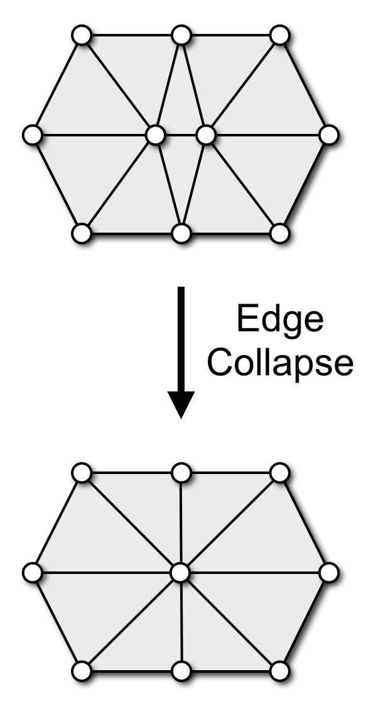{ height=500px }
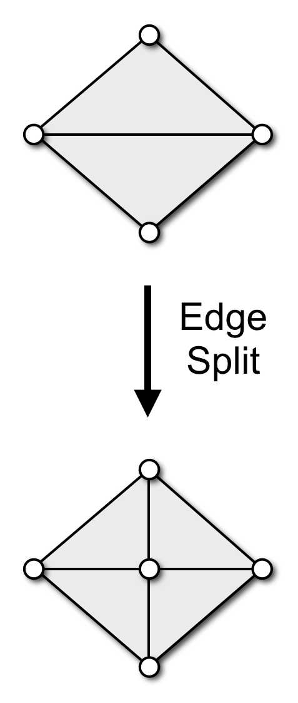{ height=500px }
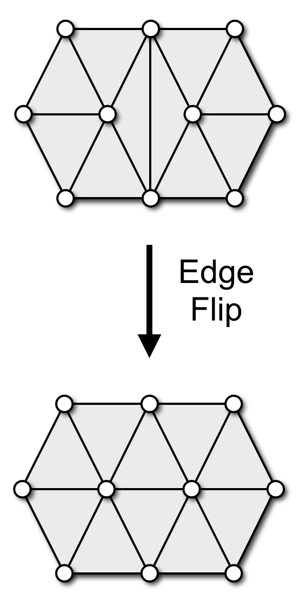{ height=500px }
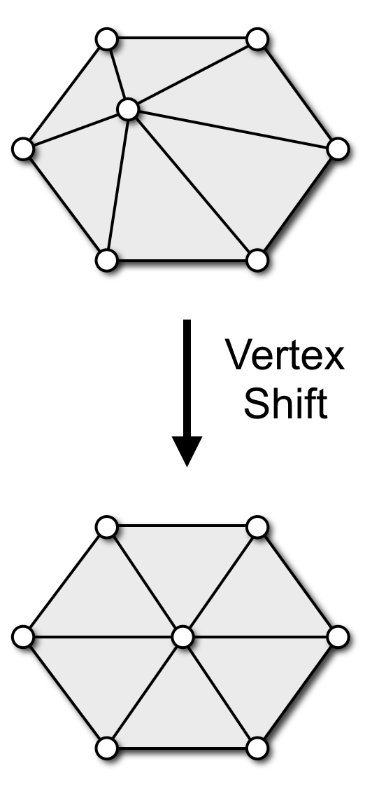{ height=500px }

[Botsch & Kobbelt, *A Remeshing Approach to Multiresolution Modeling*, SGP 2004](https://graphics.uni-bielefeld.de/publications/sgp04.pdf){target="_blank" .footer}

--------------------------------------------------------------------------------

# Adaptive Remeshing

## 6 4

- Adapt edge length to local curvature
- Compute maximum principle curvature on reference mesh
- Determine local target edge length from max-curvature
- Adjust split & collapse criteria accordingly

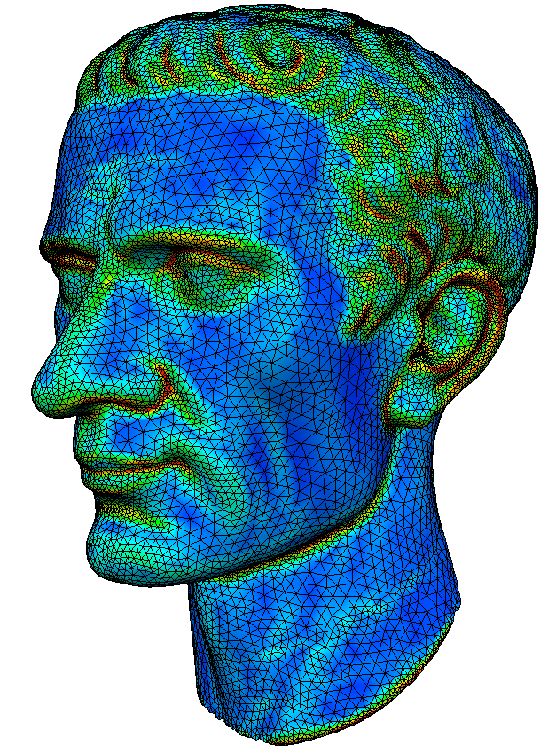{ width=400px }

[Dunyach et al, *Adaptive Remeshing for Real-Time Mesh Deformation*, EG 2013](https://graphics.uni-bielefeld.de/publications/eg13-remeshing.pdf){target="_blank" .footer}

--------------------------------------------------------------------------------

# Real-Time Remeshing

{ .autoplay .controls height=600px }

[Dunyach et al, *Adaptive Remeshing for Real-Time Mesh Deformation*, EG 2013](https://graphics.uni-bielefeld.de/publications/eg13-remeshing.pdf){target="_blank" .footer}

--------------------------------------------------------------------------------

# Real-Time Remeshing

{ .autoplay .controls height=600px }

[Dunyach et al, *Adaptive Remeshing for Real-Time Mesh Deformation*, EG 2013](https://graphics.uni-bielefeld.de/publications/eg13-remeshing.pdf){target="_blank" .footer}

--------------------------------------------------------------------------------

# Let's try!

{ #demo width=1000px height=600px }

--------------------------------------------------------------------------------

# Feature Preservation

## 6 4

- Define feature edges / vertices
	- Large dihedral angles
	- Material boundaries
- Adjust local operators
	- Don’t flip feature edges
	- Collapse only along features
	- Univariate smoothing
	- Project to feature curves
	- Don’t touch feature vertices

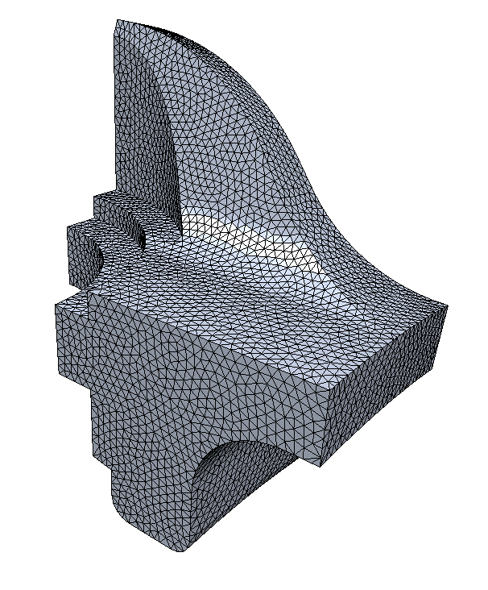{ width=400px }

--------------------------------------------------------------------------------

# Let's try!

{ #demo width=1000px height=600px }

